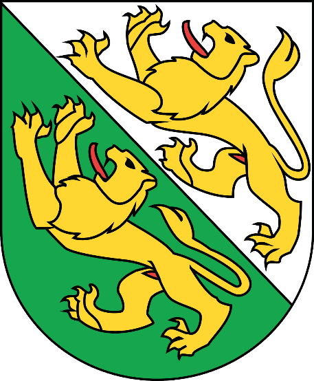

# M306_OGD_Lukas

<!-- PROJECT LOGO -->
 

    
  </a>

<h3 align="center">Landwirtschaftliche Nutzungsfläche im Thurgau</h3>

  

   Das Ziel dieser Webseite ist es, die Landwirtschaftliche Nutzungsfläche im Thurgau visuell darzustellen. Es werden dabei auf öffentlich zugängliche Daten zurückgegriffen. Die Daten sind vom Amt für Geoinformation bereitgestellt worden.
     
  

<!-- LICENSE -->

## Lizenz

Diese Webseite ist unter der MIT Lizenz lizensiert. Siehe <a href="https://opensource.org/licenses/MIT">MIT-Lizenz</a> für mehr Informationen. 
Copyright 2022 Lukas Wildeisen

<!-- Version -->

## Versionen

| Version | Datum      | Autor          | Veränderungen         |
| ------- | ---------- | -------------- | --------------------- |
| 1.0     | 23.12.2022 | Lukas Wildeisen | Erstellung Webseitete |

<!-- Installation-Manual-->

## Installation

<!--NetBeans-->

### Netbeans

Um dieses Projekt zu installiere, müssen Sie folgende Schritte befolgen:

1. Sie müssen über <>Code denn Code als ZIP herunterladen.
2. Speichern Sie das Projekt, so dass sie es wieder finden.
3. Gehen Sie auf Netbeans und öffnen Sie das Projekt
4. Klicken Sie auf Run
5. Voilà! Die Applikation ist nun gestartet und sie können sie benutzen.

<!--VS Code-->

### VS Code

1. Sie müssen über <>Code denn Code als ZIP herunterladen.
2. Speichern Sie das Projekt, so dass sie es wieder finden.
3. Gehen Sie auf VS Code und öffnen Sie das Projekt.
4. Öffnen sie die die index.php Datei.
5. Gehen Sie auf Run.
6. Dann drücken Sie auf 'Run Without Debugging'.
7. Voilà! Die Webseite wird aufgerufen. Sie können sie nun benutzen.

Fals dies nicht Funktioniert hat, machen Sie bitte ein Issue auf. Wir werden uns darum kümmern. Vielen Dank!

<!--Data-->

## Daten

- [openData.swiss](https://opendata.swiss/de/dataset/nutzungsflachen)

<!-- Authors-->

## Entwickler

- [Lukas](https://github.com/luw-i)
